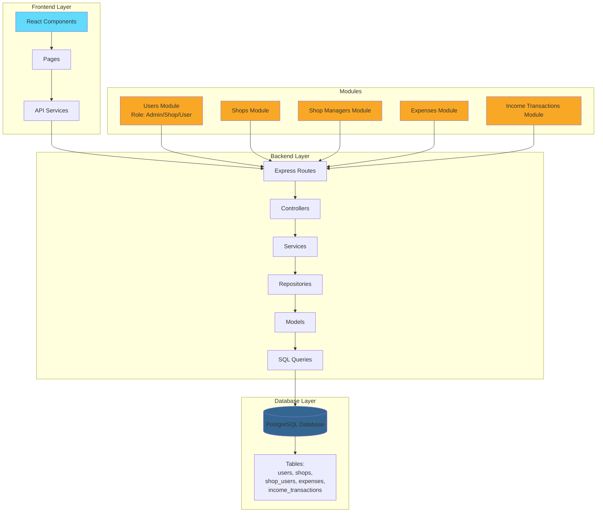

# Ship4wd

Full-stack application with React frontend and Node.js backend for managing grocery shop revenue analytics.

## 🚀 Quick Start

### What to Do:

1. **Install all dependencies:**
   ```bash
   npm install
   ```
   This will install all dependencies for both backend and frontend.

2. **Setup database connection:**
   - Go to `backend` folder
   - Copy `.env.example` to `.env` (remove EXAMPLE)
   - Edit `.env` and add your database connection details

3. **Run the project:**
   ```bash
   npm run dev
   ```
   This will automatically start everything and connect to your database!

**Important:** This system uses real database connections with real data. If you modify or edit anything, please take this into account.

## 📋 P

### Automatic Database Setup

When you start the backend, it automatically:
- ✅ Tests database connection
- ✅ Creates necessary tables (migrations)
- ✅ Seeds initial data (if database is empty)

**No manual migration or seeding needed!**

## 📁 Project Overview

This is a comprehensive management system for grocery shops with role-based access control. The system includes user management, shop management, shop managers assignment, and financial tracking (income transactions and expenses). Each module follows a clean architecture pattern with separation of concerns: Routes → Controllers → Services → Repositories → Models → Queries.

**Key Features:**
- **Role-Based System**: Admin, Shop Manager, and User roles with different permissions
- **Shop Management**: Create, update, and manage shops with assigned managers
- **Financial Tracking**: Track income transactions (customer payments) and expenses per shop
- **Revenue Analytics**: Interactive dashboard with charts showing daily income, outcome, and clear revenue
- **Real-time Data**: All data is connected to PostgreSQL database

## 🌐 Access the Application

- **Frontend**: http://localhost:5173
- **Backend API**: http://localhost:4000
- **Health Check**: http://localhost:4000/health

## 📊 Features

- **Revenue Analytics Dashboard**: View daily income, outcome, and clear revenue on an interactive chart
- **Date Range Filtering**: Filter data by custom date ranges (default: June 1, 2024 - December 31, 2024)
- **Real-time Data**: Connected to PostgreSQL database
- **Responsive Design**: Works on desktop and mobile devices
- **User Management**: Create and manage users with different roles (Admin, Shop, User)
- **Shop Management**: Manage shops with descriptions, addresses, and phone numbers
- **Shop Managers**: Assign multiple managers to shops
- **Financial Tracking**: Track income transactions and expenses per shop

## 🛠️ Available Scripts

### Root Level

- `npm install` - Install all dependencies (root, backend, frontend)
- `npm run dev` - Start both backend and frontend servers
- `npm run dev:backend` - Start only backend
- `npm run dev:frontend` - Start only frontend

### Backend

- `npm run dev` - Start development server (auto-runs migrations & seeders)
- `npm run build` - Build for production
- `npm start` - Start production server
- `npm run migrate` - Manually run migrations (optional)
- `npm run seed` - Manually run seeders (optional)

### Frontend

- `npm run dev` - Start development server
- `npm run build` - Build for production
- `npm run preview` - Preview production build

## 🛠️ Tech Stack

- **Frontend**: React 19, Vite, Tailwind CSS, React Router, React Google Charts
- **Backend**: Node.js, Express, TypeScript, PostgreSQL
- **Database**: PostgreSQL

## ⚠️ Troubleshooting

### Database Connection Issues

- Verify `DATABASE_URL` in `backend/.env` is correct
- Ensure database server is running and accessible
- Check firewall settings for remote databases
- Verify SSL settings match your provider

### Port Already in Use

- Backend: Change `PORT` in `backend/.env`
- Frontend: Vite will auto-use next available port

### Migration Errors

- Ensure database exists and is accessible
- Check database user has CREATE TABLE permissions
- Verify connection string format

## 📝 Notes

- Default date range: June 1, 2024 - December 31, 2024
- Chart displays: Income (red), Outcome (blue), Clear Revenue (green)
- Header shows current date range
- Footer is intentionally empty

## 🏗️ Project Architecture



### Architecture Layers:

1. **Frontend Layer**: React components, pages, and API service layer
2. **Backend Layer**: Express routes, controllers, services, repositories, models, and SQL queries
3. **Database Layer**: PostgreSQL with tables for users, shops, shop_users, expenses, and income_transactions
4. **Modules**: Separate modules for users, shops, shop managers, expenses, and income transactions

### Data Flow:

- Frontend makes API calls through services
- Routes handle HTTP requests
- Controllers process requests and call services
- Services contain business logic
- Repositories handle data access
- Models define data structures
- Queries execute SQL against PostgreSQL database
