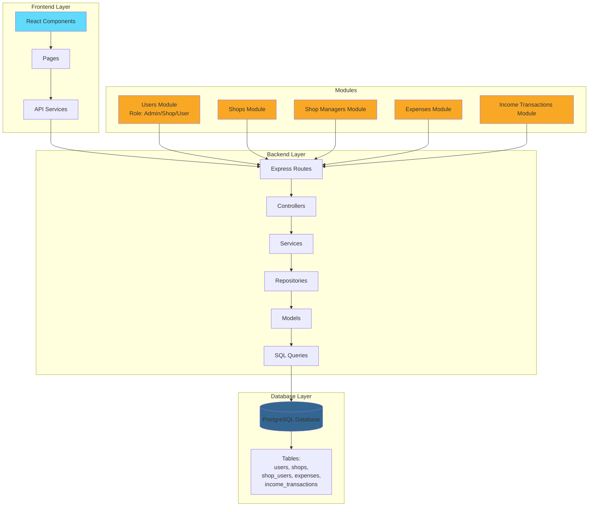

# Ship4wd

Full-stack application with React frontend and Node.js backend for managing grocery shop revenue analytics.

## 🚀 Quick Start

1. **Install all dependencies:**

   ```bash
   npm install
   ```

2. **Setup database connection:**

   - Go to `backend` folder
   - Copy `.env.example` to `.env` (remove EXAMPLE)
   - Edit `.env` and add your database connection details

3. **Run the project:**
   ```bash
   npm run dev
   ```
   This will automatically start everything and connect to your database!

**Important:** This system uses real database connections with real data. If you modify or edit anything, please take this into account.

## 📁 Project Overview

Management system for grocery shops with role-based access control (Admin, Shop Manager, User). Includes user management, shop management, shop managers assignment, and financial tracking (income transactions and expenses). Architecture: Routes → Controllers → Services → Repositories → Models → Queries.

## 🌐 Access

- **Frontend**: http://localhost:5173
- **Backend API**: http://localhost:4000
- **Swagger API Documentation**: http://localhost:4000/api-docs

## 🛠️ Tech Stack

- **Frontend**: React 19, Vite, Tailwind CSS, React Router, React Google Charts
- **Backend**: Node.js, Express, TypeScript, PostgreSQL

## 🏗️ Project Architecture


