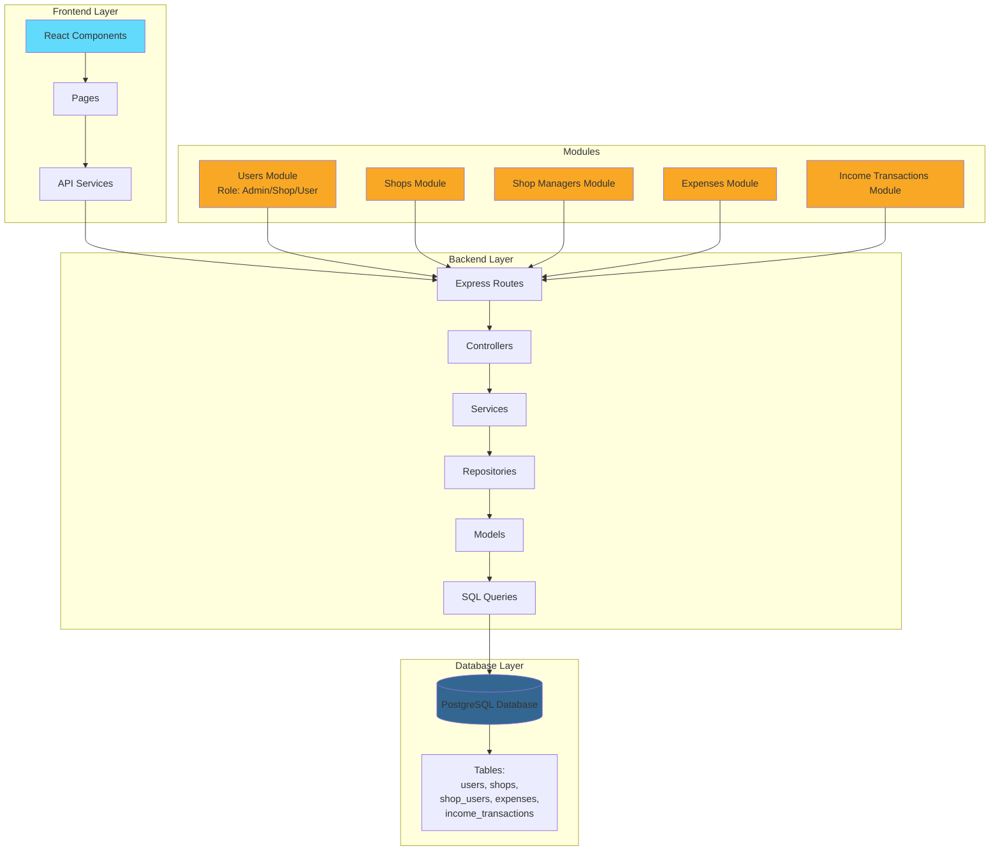

# Ship4wd

Full-stack application with React frontend and Node.js backend for managing grocery shop revenue analytics.

## 🚀 Quick Start

1. **Install all dependencies:**

   ```bash
   npm install
   ```

2. **Setup database connection:**

   - Go to `backend` folder
   - Copy `.env.example` to `.env` (remove EXAMPLE)
   - Edit `.env` and add your database connection details

3. **Run the project:**
   ```bash
   npm run dev
   ```
   This will automatically start everything and connect to your database!

**Important:** This system uses real database connections with real data. If you modify or edit anything, please take this into account.

## 🔐 Login Credentials

After starting the application, you can log in using the following test accounts:

### Admin User

- **Email:** `admin@admin.com`
- **Password:** `123456`
- **Role:** `admin`

### Shop Manager User

- **Email:** `admin@admin1.com`
- **Password:** `123456`
- **Role:** `shop`

### Regular User

- **Email:** `admin@admin2.com`
- **Password:** `123456`
- **Role:** `user`

## 👥 User Roles & Permissions

The system implements role-based access control (RBAC) with three distinct user roles, each providing different levels of access and functionality:

### Admin Role

**Access Level:** Full system access

**Available Pages:**

- **Home** - Dashboard overview
- **Analytics** - System-wide analytics and reports
- **Users** - User management interface
- **Manage Shops** - Complete shop management
- **Customer Payments** - View and manage customer payment transactions
- **Shop Payments** - View and manage shop payment transactions

**Capabilities:**

- **User Management:** Create, edit, and delete users (with role-based restrictions)
- **Shop Management:** Full control over all shops in the system
- **Financial Tracking:** Access to all income transactions and expenses across all shops
- **Analytics:** System-wide analytics and reporting capabilities
- **Role Assignment:** Can assign and modify user roles (Admin, Shop, User)

**Impact:**
Admins have complete oversight and control over the entire system. They can manage all users, shops, and financial data. When managing users, admins can only perform actions based on the target user's role - ensuring proper hierarchical access control.

### Shop Manager Role

**Access Level:** Shop-specific management

**Available Pages:**

- **Home** - Dashboard overview
- **My Shops** - View and manage assigned shops

**Capabilities:**

- **Shop Management:** Manage shops assigned to them
- **Financial Tracking:** View and manage income transactions and expenses for their assigned shops
- **Shop Operations:** Create, update, and manage shop details for shops they are assigned to

**Impact:**
Shop managers can only access and manage shops that have been assigned to them by administrators. This ensures that shop managers can only view and modify data relevant to their specific shops, maintaining data isolation and security between different shop operations.

### User Role

**Access Level:** Read-only and basic viewing

**Available Pages:**

- **Home** - Dashboard overview
- **Shops** - View available shops

**Capabilities:**

- **Shop Viewing:** View available shops in the system
- **Read-Only Access:** Can view shop information but cannot modify or manage shops
- **Limited Analytics:** Basic viewing of shop-related information

**Impact:**
Regular users have the most restricted access level. They can view shops and basic information but cannot perform any management operations. This role is designed for end-users who need to browse shop information without administrative privileges.

## 📁 Project Overview

Management system for grocery shops with role-based access control (Admin, Shop Manager, User). Includes user management, shop management, shop managers assignment, and financial tracking (income transactions and expenses). Architecture: Routes → Controllers → Services → Repositories → Models → Queries.

## 🌐 Access

- **Frontend**: http://localhost:5173
- **Backend API**: http://localhost:4000
- **Swagger API Documentation**: http://localhost:4000/api-docs

## 🛠️ Tech Stack

- **Frontend**: React 19, Vite, Tailwind CSS, React Router, React Google Charts
- **Backend**: Node.js, Express, TypeScript, PostgreSQL

## 🏗️ Project Architecture


